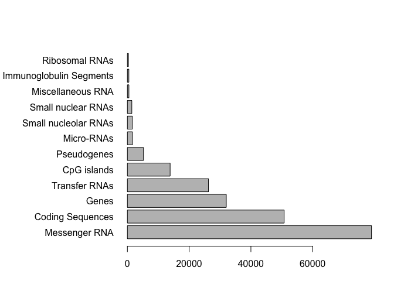

Class 5: R Graphics
================
Ji H. Kang

``` r
# 2A. Line plot
weight <- read.table("bimm143_05_rstats/weight_chart.txt", header=TRUE)
#header=true the V1,V2 goes away 

plot(weight$Age,weight$Weight,
     xlab="Age (months)", ylab="Weight (kg)",main="Baby Weight w/ Age",
     typ="b",
     pch=15,cex=1.5,lwd=2,
     ylim = c(2,10))
```


``` r
#2B. Bar Plot
read.table("bimm143_05_rstats/feature_counts.txt",header=TRUE,sep="\t")
```

    ##                    Feature Count
    ## 1            Messenger RNA 79049
    ## 2         Coding Sequences 50770
    ## 3                    Genes 32029
    ## 4            Transfer RNAs 26248
    ## 5              CpG islands 13840
    ## 6              Pseudogenes  5195
    ## 7               Micro-RNAs  1638
    ## 8     Small nucleolar RNAs  1602
    ## 9       Small nuclear RNAs  1431
    ## 10       Miscellaneous RNA   491
    ## 11 Immunoglobulin Segments   474
    ## 12          Ribosomal RNAs   341

``` r
mouse <- read.table("bimm143_05_rstats/feature_counts.txt",header=TRUE,sep="\t")
barplot(mouse$Count,
        horiz = TRUE,
        ylab="",
        names.arg = mouse$Feature,
        main= "# of Features in the Mouse GCRm28 Gene",
        las=1)
```


``` r
barplot(mouse$Count)
```


``` r
#I need to argue
barplot(mouse$Count,
        names.arg = mouse$Feature)
```


``` r
#Rotate whole plot
barplot(mouse$Count,names.arg = mouse$Feature,
        horiz=TRUE)
```


``` r
#Fix label 
barplot(mouse$Count,names.arg = mouse$Feature,horiz=TRUE,
        las=1)
#Fix parameter: cannot see the full label PAR
par(mar=c(3.1, 11.1, 4.1, 2))
barplot(mouse$Count,names.arg = mouse$Feature,horiz=TRUE, las=1)
```



``` r
#Name of bar and range
par(mar=c(3.1, 11.1, 4.1, 2))
barplot(mouse$Count,names.arg = mouse$Feature,horiz=TRUE, las=1, xlim=c(0,80000),
        main="Number of Features in the Mouse GRCm38 Genome")
```


``` r
#Section 3: Using Color in Plots

#3A. Providing color vectors
counts <- read.table("bimm143_05_rstats/male_female_counts.txt",
                     sep="\t", header=TRUE)
# read delim <- convenience (format already encoded)
counts <- read.delim("bimm143_05_rstats/male_female_counts.txt")

barplot(counts$Count, names.arg = counts$Sample,
        las=2,
        col=c("red","blue"))
```


``` r
barplot(counts$Count, names.arg = counts$Sample,las=2,
        col=rainbow(10))
```


``` r
barplot(counts$Count, names.arg = counts$Sample,las=2,
        col=heat.colors(10))
```


