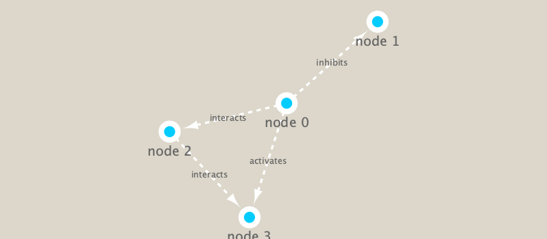

```{r}
library(RCy3)
library(igraph)
library(RColorBrewer)
```


```{r}
# Test the connection to Cytoscape.
cytoscapePing()
```

We can test things further by making a small network (here in igraph format as used by the R igraph package) and sending it to Cytoscape:

```{r}
g <- makeSimpleIgraph()
createNetworkFromIgraph(g,"myGraph")
```

change network dislay style in cytoscape
```{r}
setVisualStyle("Marquee")
```


Export image command
```{r}
fig <- exportImage(filename="demo_marquee", type="png", height=350)


```


```{r}
plot(g)
```

##Read our metagenomics data

```{r}
## scripts for processing located in "inst/data-raw/"
prok_vir_cor <- read.delim("virus_prok_cor_abundant.tsv", stringsAsFactors = FALSE)

## Have a peak at the first 6 rows
head(prok_vir_cor)
```


```{r}
g <- graph.data.frame(prok_vir_cor, directed = FALSE)
plot(g)
```

Turn the node (vertex) labels off in this plot
```{r}
plot(g, vertex.label=NA)
```

The nodes/vertex are too big. Lets make them smaller...
```{r}
plot(g, vertex.size=3, vertex.label=NA)
```

#To send this network to Cytoscape we can use the command:
```{r}
createNetworkFromIgraph(g,"myIgraph")
```

Note that we can query (and set) vertex and edge attributes with the V() and E() functions respectively:
```{r}
V(g)
```
```{r}
E(g)
```

##Network community detection
```{r}
cb <- cluster_edge_betweenness(g)
```

```{r}
cb
```

```{r}
plot(cb, y=g, vertex.label=NA,  vertex.size=3)
```


## Node degree

```{r}
# Calculate and plot node degree of our network
d <- degree(g)
hist(d, breaks=30, col="lightblue", main ="Node Degree Distribution")
```
```{r}
plot( degree_distribution(g), type="h" )
```

## Centrality Analysis 
Centrality gives an estimation on how important a node or edge is for the connectivity (or the information flow) of a network
Useful parameter in signaling networks- used when trying to find drug targets for example
Q: Which nodes are the most important and why?

```{r}
pr <- page_rank(g)
head(pr$vector)
```

```{r}
# Make a size vector btwn 2 and 20 for node plotting size

v.size <- BBmisc::normalize(pr$vector, range=c(2,20), method="range")
plot(g, vertex.size=v.size, vertex.label=NA)

```

```{r}
v.size <- BBmisc::normalize(d, range=c(2,20), method="range")
plot(g, vertex.size=v.size, vertex.label=NA)
```

```{r}
b <- betweenness(g)
v.size <- BBmisc::normalize(b, range=c(2,20), method="range")
plot(g, vertex.size=v.size, vertex.label=NA)
```


##Read taxonomic classification for network annotation
```{r}
phage_id_affiliation <- read.delim("phage_ids_with_affiliation.tsv")
head(phage_id_affiliation)
```

```{r}
bac_id_affi <- read.delim("prok_tax_from_silva.tsv", stringsAsFactors = FALSE)
head(bac_id_affi)
```


