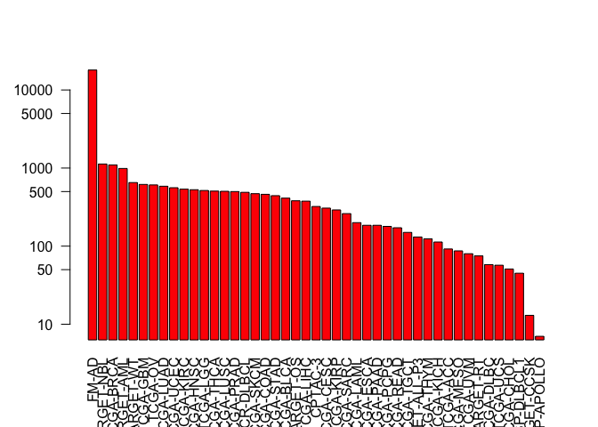
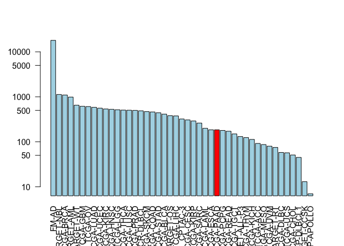

18
================
Ji H. Kang

Exploring the Cancer Genome Atlas
---------------------------------

Install the packages we need

``` r
BiocManager::install(c("GenomicDataCommons", "TCGAbiolinks", "maftools"))
```

load the packages, as usual

``` r
library(GenomicDataCommons)
```

    ## Loading required package: magrittr

    ## 
    ## Attaching package: 'GenomicDataCommons'

    ## The following object is masked from 'package:stats':
    ## 
    ##     filter

``` r
library(TCGAbiolinks)
library(maftools)
```

GDC status:

``` r
GenomicDataCommons::status()
```

    ## $commit
    ## [1] "e588f035feefee17f562b3a1bc2816c49a2b2b19"
    ## 
    ## $data_release
    ## [1] "Data Release 16.0 - March 26, 2019"
    ## 
    ## $status
    ## [1] "OK"
    ## 
    ## $tag
    ## [1] "1.20.0"
    ## 
    ## $version
    ## [1] 1

Query the GDC from R
--------------------

``` r
cases_by_project <- cases() %>%
  facet("project.project_id") %>%
  aggregations()
head(cases_by_project)
```

    ## $project.project_id
    ##               key doc_count
    ## 1           FM-AD     18004
    ## 2      TARGET-NBL      1127
    ## 3       TCGA-BRCA      1098
    ## 4      TARGET-AML       988
    ## 5       TARGET-WT       652
    ## 6        TCGA-GBM       617
    ## 7         TCGA-OV       608
    ## 8       TCGA-LUAD       585
    ## 9       TCGA-UCEC       560
    ## 10      TCGA-KIRC       537
    ## 11      TCGA-HNSC       528
    ## 12       TCGA-LGG       516
    ## 13      TCGA-THCA       507
    ## 14      TCGA-LUSC       504
    ## 15      TCGA-PRAD       500
    ## 16   NCICCR-DLBCL       489
    ## 17      TCGA-SKCM       470
    ## 18      TCGA-COAD       461
    ## 19      TCGA-STAD       443
    ## 20      TCGA-BLCA       412
    ## 21      TARGET-OS       381
    ## 22      TCGA-LIHC       377
    ## 23        CPTAC-3       322
    ## 24      TCGA-CESC       307
    ## 25      TCGA-KIRP       291
    ## 26      TCGA-SARC       261
    ## 27      TCGA-LAML       200
    ## 28      TCGA-ESCA       185
    ## 29      TCGA-PAAD       185
    ## 30      TCGA-PCPG       179
    ## 31      TCGA-READ       172
    ## 32      TCGA-TGCT       150
    ## 33  TARGET-ALL-P3       131
    ## 34      TCGA-THYM       124
    ## 35      TCGA-KICH       113
    ## 36       TCGA-ACC        92
    ## 37      TCGA-MESO        87
    ## 38       TCGA-UVM        80
    ## 39      TARGET-RT        75
    ## 40      TCGA-DLBC        58
    ## 41       TCGA-UCS        57
    ## 42      TCGA-CHOL        51
    ## 43    CTSP-DLBCL1        45
    ## 44    TARGET-CCSK        13
    ## 45 VAREPOP-APOLLO         7

Q9. Write the R code to make a barplot of the cases per project. Lets plot this data with a log scale for the y axis (log="y"), rotated axis labels (las=2) and color the bar coresponding to the TCGA-PAAD project.

``` r
x <- cases_by_project$project.project_id

# Make a custom color vector for our plot
colvec <- rep("lightblue", nrow(x))
colvec[] <- "red"

# Plot with 'log' for y axis and rotate labels with 'las'
#par(___)  
barplot(x$doc_count, names.arg=x$key, log="y", col=colvec, las=2)
```



``` r
# Make a custom color vector for our plot
colvec <- rep("lightblue", nrow(x))
colvec[29] <- "red"

# Plot with 'log' for y axis and rotate labels with 'las'
#par(___)  
barplot(x$doc_count, names.arg=x$key, log="y", col=colvec, las=2)
```



PART 2: Designing a Personalized Cancer Vaccine
-----------------------------------------------

Section 1: Protein sequences from healthy and tumor tissue
==========================================================

TASK: identify tumor specific mutations that could potentially be used for vaccine development Q1:Identify sequence regions that contain all 9-mer peptides that are only found in the tumor. Hint: You will need to first identify the sites of mutation in the above sequences and then extract the surrounding subsequence region. This subsequence should encompass all possible 9-mers in the tumor derived sequence. In other words extract the subsequence from 8 residues before and 8 residues after all point mutations in the tumor sequence. IDENTIFY TUMOR SPECIFIC 9-mer peptides

``` r
library(bio3d)
seqs <- read.fasta("lecture18_sequences.fa")
seqs
```

    ##              1        .         .         .         .         .         60 
    ## P53_wt       MEEPQSDPSVEPPLSQETFSDLWKLLPENNVLSPLPSQAMDDLMLSPDDIEQWFTEDPGP
    ## P53_mutant   MEEPQSDPSVEPPLSQETFSDLWKLLPENNVLSPLPSQAMLDLMLSPDDIEQWFTEDPGP
    ##              **************************************** ******************* 
    ##              1        .         .         .         .         .         60 
    ## 
    ##             61        .         .         .         .         .         120 
    ## P53_wt       DEAPRMPEAAPPVAPAPAAPTPAAPAPAPSWPLSSSVPSQKTYQGSYGFRLGFLHSGTAK
    ## P53_mutant   DEAPWMPEAAPPVAPAPAAPTPAAPAPAPSWPLSSSVPSQKTYQGSYGFRLGFLHSGTAK
    ##              **** ******************************************************* 
    ##             61        .         .         .         .         .         120 
    ## 
    ##            121        .         .         .         .         .         180 
    ## P53_wt       SVTCTYSPALNKMFCQLAKTCPVQLWVDSTPPPGTRVRAMAIYKQSQHMTEVVRRCPHHE
    ## P53_mutant   SVTCTYSPALNKMFCQLAKTCPVQLWVDSTPPPGTRVRAMAIYKQSQHMTEVVRRCPHHE
    ##              ************************************************************ 
    ##            121        .         .         .         .         .         180 
    ## 
    ##            181        .         .         .         .         .         240 
    ## P53_wt       RCSDSDGLAPPQHLIRVEGNLRVEYLDDRNTFRHSVVVPYEPPEVGSDCTTIHYNYMCNS
    ## P53_mutant   RCSDSDGLAPPQHLIRVEGNLRVEYLDDRNTFVHSVVVPYEPPEVGSDCTTIHYNYMCNS
    ##              ******************************** *************************** 
    ##            181        .         .         .         .         .         240 
    ## 
    ##            241        .         .         .         .         .         300 
    ## P53_wt       SCMGGMNRRPILTIITLEDSSGNLLGRNSFEVRVCACPGRDRRTEEENLRKKGEPHHELP
    ## P53_mutant   SCMGGMNRRPILTIITLEV-----------------------------------------
    ##              ******************                                           
    ##            241        .         .         .         .         .         300 
    ## 
    ##            301        .         .         .         .         .         360 
    ## P53_wt       PGSTKRALPNNTSSSPQPKKKPLDGEYFTLQIRGRERFEMFRELNEALELKDAQAGKEPG
    ## P53_mutant   ------------------------------------------------------------
    ##                                                                           
    ##            301        .         .         .         .         .         360 
    ## 
    ##            361        .         .         .  393 
    ## P53_wt       GSRAHSSHLKSKKGQSTSRHKKLMFKTEGPDSD
    ## P53_mutant   ---------------------------------
    ##                                                
    ##            361        .         .         .  393 
    ## 
    ## Call:
    ##   read.fasta(file = "lecture18_sequences.fa")
    ## 
    ## Class:
    ##   fasta
    ## 
    ## Alignment dimensions:
    ##   2 sequence rows; 393 position columns (259 non-gap, 134 gap) 
    ## 
    ## + attr: id, ali, call

FIND THE DIFFERENCES BETWEEN THE SEQUENES: MUTATIONS

``` r
ide <- conserv(seqs, method = "identity")
ide
```

    ##   [1] 1.0 1.0 1.0 1.0 1.0 1.0 1.0 1.0 1.0 1.0 1.0 1.0 1.0 1.0 1.0 1.0 1.0
    ##  [18] 1.0 1.0 1.0 1.0 1.0 1.0 1.0 1.0 1.0 1.0 1.0 1.0 1.0 1.0 1.0 1.0 1.0
    ##  [35] 1.0 1.0 1.0 1.0 1.0 1.0 0.5 1.0 1.0 1.0 1.0 1.0 1.0 1.0 1.0 1.0 1.0
    ##  [52] 1.0 1.0 1.0 1.0 1.0 1.0 1.0 1.0 1.0 1.0 1.0 1.0 1.0 0.5 1.0 1.0 1.0
    ##  [69] 1.0 1.0 1.0 1.0 1.0 1.0 1.0 1.0 1.0 1.0 1.0 1.0 1.0 1.0 1.0 1.0 1.0
    ##  [86] 1.0 1.0 1.0 1.0 1.0 1.0 1.0 1.0 1.0 1.0 1.0 1.0 1.0 1.0 1.0 1.0 1.0
    ## [103] 1.0 1.0 1.0 1.0 1.0 1.0 1.0 1.0 1.0 1.0 1.0 1.0 1.0 1.0 1.0 1.0 1.0
    ## [120] 1.0 1.0 1.0 1.0 1.0 1.0 1.0 1.0 1.0 1.0 1.0 1.0 1.0 1.0 1.0 1.0 1.0
    ## [137] 1.0 1.0 1.0 1.0 1.0 1.0 1.0 1.0 1.0 1.0 1.0 1.0 1.0 1.0 1.0 1.0 1.0
    ## [154] 1.0 1.0 1.0 1.0 1.0 1.0 1.0 1.0 1.0 1.0 1.0 1.0 1.0 1.0 1.0 1.0 1.0
    ## [171] 1.0 1.0 1.0 1.0 1.0 1.0 1.0 1.0 1.0 1.0 1.0 1.0 1.0 1.0 1.0 1.0 1.0
    ## [188] 1.0 1.0 1.0 1.0 1.0 1.0 1.0 1.0 1.0 1.0 1.0 1.0 1.0 1.0 1.0 1.0 1.0
    ## [205] 1.0 1.0 1.0 1.0 1.0 1.0 1.0 1.0 0.5 1.0 1.0 1.0 1.0 1.0 1.0 1.0 1.0
    ## [222] 1.0 1.0 1.0 1.0 1.0 1.0 1.0 1.0 1.0 1.0 1.0 1.0 1.0 1.0 1.0 1.0 1.0
    ## [239] 1.0 1.0 1.0 1.0 1.0 1.0 1.0 1.0 1.0 1.0 1.0 1.0 1.0 1.0 1.0 1.0 1.0
    ## [256] 1.0 1.0 1.0 0.5 0.5 0.5 0.5 0.5 0.5 0.5 0.5 0.5 0.5 0.5 0.5 0.5 0.5
    ## [273] 0.5 0.5 0.5 0.5 0.5 0.5 0.5 0.5 0.5 0.5 0.5 0.5 0.5 0.5 0.5 0.5 0.5
    ## [290] 0.5 0.5 0.5 0.5 0.5 0.5 0.5 0.5 0.5 0.5 0.5 0.5 0.5 0.5 0.5 0.5 0.5
    ## [307] 0.5 0.5 0.5 0.5 0.5 0.5 0.5 0.5 0.5 0.5 0.5 0.5 0.5 0.5 0.5 0.5 0.5
    ## [324] 0.5 0.5 0.5 0.5 0.5 0.5 0.5 0.5 0.5 0.5 0.5 0.5 0.5 0.5 0.5 0.5 0.5
    ## [341] 0.5 0.5 0.5 0.5 0.5 0.5 0.5 0.5 0.5 0.5 0.5 0.5 0.5 0.5 0.5 0.5 0.5
    ## [358] 0.5 0.5 0.5 0.5 0.5 0.5 0.5 0.5 0.5 0.5 0.5 0.5 0.5 0.5 0.5 0.5 0.5
    ## [375] 0.5 0.5 0.5 0.5 0.5 0.5 0.5 0.5 0.5 0.5 0.5 0.5 0.5 0.5 0.5 0.5 0.5
    ## [392] 0.5 0.5

``` r
which(ide<1)
```

    ##   [1]  41  65 213 259 260 261 262 263 264 265 266 267 268 269 270 271 272
    ##  [18] 273 274 275 276 277 278 279 280 281 282 283 284 285 286 287 288 289
    ##  [35] 290 291 292 293 294 295 296 297 298 299 300 301 302 303 304 305 306
    ##  [52] 307 308 309 310 311 312 313 314 315 316 317 318 319 320 321 322 323
    ##  [69] 324 325 326 327 328 329 330 331 332 333 334 335 336 337 338 339 340
    ##  [86] 341 342 343 344 345 346 347 348 349 350 351 352 353 354 355 356 357
    ## [103] 358 359 360 361 362 363 364 365 366 367 368 369 370 371 372 373 374
    ## [120] 375 376 377 378 379 380 381 382 383 384 385 386 387 388 389 390 391
    ## [137] 392 393

``` r
miss.match.sites <- which (ide < 1)
gap.sites <- gap.inspect(seqs)$t.inds
```

``` r
tumor.sites <-miss.match.sites[ !miss.match.sites %in% gap.sites]
tumor.sites
```

    ## [1]  41  65 213 259

Now get the sequence with all possible 9-mers

``` r
start.position <- tumor.sites - 8
end.position <- tumor.sites + 8
```

``` r
start.position[1] : end.position[1]
```

    ##  [1] 33 34 35 36 37 38 39 40 41 42 43 44 45 46 47 48 49

Get tumor sequence

``` r
seqs$ali[2,]
```

    ##   [1] "M" "E" "E" "P" "Q" "S" "D" "P" "S" "V" "E" "P" "P" "L" "S" "Q" "E"
    ##  [18] "T" "F" "S" "D" "L" "W" "K" "L" "L" "P" "E" "N" "N" "V" "L" "S" "P"
    ##  [35] "L" "P" "S" "Q" "A" "M" "L" "D" "L" "M" "L" "S" "P" "D" "D" "I" "E"
    ##  [52] "Q" "W" "F" "T" "E" "D" "P" "G" "P" "D" "E" "A" "P" "W" "M" "P" "E"
    ##  [69] "A" "A" "P" "P" "V" "A" "P" "A" "P" "A" "A" "P" "T" "P" "A" "A" "P"
    ##  [86] "A" "P" "A" "P" "S" "W" "P" "L" "S" "S" "S" "V" "P" "S" "Q" "K" "T"
    ## [103] "Y" "Q" "G" "S" "Y" "G" "F" "R" "L" "G" "F" "L" "H" "S" "G" "T" "A"
    ## [120] "K" "S" "V" "T" "C" "T" "Y" "S" "P" "A" "L" "N" "K" "M" "F" "C" "Q"
    ## [137] "L" "A" "K" "T" "C" "P" "V" "Q" "L" "W" "V" "D" "S" "T" "P" "P" "P"
    ## [154] "G" "T" "R" "V" "R" "A" "M" "A" "I" "Y" "K" "Q" "S" "Q" "H" "M" "T"
    ## [171] "E" "V" "V" "R" "R" "C" "P" "H" "H" "E" "R" "C" "S" "D" "S" "D" "G"
    ## [188] "L" "A" "P" "P" "Q" "H" "L" "I" "R" "V" "E" "G" "N" "L" "R" "V" "E"
    ## [205] "Y" "L" "D" "D" "R" "N" "T" "F" "V" "H" "S" "V" "V" "V" "P" "Y" "E"
    ## [222] "P" "P" "E" "V" "G" "S" "D" "C" "T" "T" "I" "H" "Y" "N" "Y" "M" "C"
    ## [239] "N" "S" "S" "C" "M" "G" "G" "M" "N" "R" "R" "P" "I" "L" "T" "I" "I"
    ## [256] "T" "L" "E" "V" "-" "-" "-" "-" "-" "-" "-" "-" "-" "-" "-" "-" "-"
    ## [273] "-" "-" "-" "-" "-" "-" "-" "-" "-" "-" "-" "-" "-" "-" "-" "-" "-"
    ## [290] "-" "-" "-" "-" "-" "-" "-" "-" "-" "-" "-" "-" "-" "-" "-" "-" "-"
    ## [307] "-" "-" "-" "-" "-" "-" "-" "-" "-" "-" "-" "-" "-" "-" "-" "-" "-"
    ## [324] "-" "-" "-" "-" "-" "-" "-" "-" "-" "-" "-" "-" "-" "-" "-" "-" "-"
    ## [341] "-" "-" "-" "-" "-" "-" "-" "-" "-" "-" "-" "-" "-" "-" "-" "-" "-"
    ## [358] "-" "-" "-" "-" "-" "-" "-" "-" "-" "-" "-" "-" "-" "-" "-" "-" "-"
    ## [375] "-" "-" "-" "-" "-" "-" "-" "-" "-" "-" "-" "-" "-" "-" "-" "-" "-"
    ## [392] "-" "-"

``` r
seqs$ali[2, start.position[1] : end.position[1]]
```

    ##  [1] "S" "P" "L" "P" "S" "Q" "A" "M" "L" "D" "L" "M" "L" "S" "P" "D" "D"
